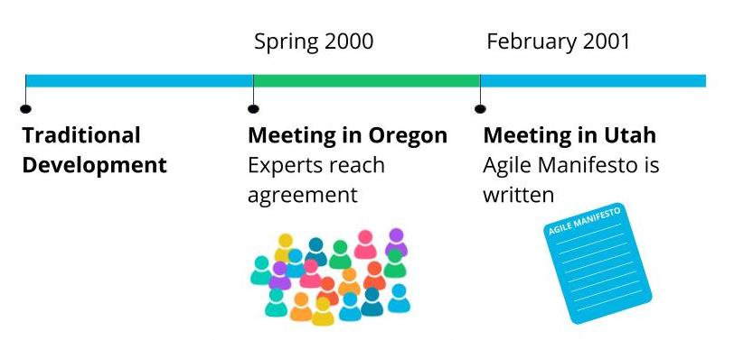

# The History of Agile

## Where Did Agile Come From?

Agile came into existence based on a business need.

- Agile emerged **organically** as a result of a **market need** to deal with the crisis product development faced in the _1990s_.
- The delay **(2-4 years)** in software solution to production was not acceptable for enterprise business users.
- The market started realizing that both the needs and expectations from the business users would not **remain static** for so long(2-4 years).
- Change was **inevitable** before the product made it to market, which was difficult to **maneuver** with traditional product **development models**.

A growing number of experts felt that there had to be a better way to build products with a focus on:

- business users, and
- business value.

### History of Agile

In the **Spring** of _2000_, a group of industry experts gathered in Oregon to come up with some common ground on Agile. This meeting led to a famous gathering in Utah in February _2001_ where 17 thought leaders finalized **The Agile Manifesto**. This historic gathering set the foundation for all Agile frameworks.

#### The Agile Approach to Fast Delivery

The experts sought ways to:

- **Quickly build** working solutions.
- Get solutions into hands of end-users.

This fast delivery approach provided a couple of important benefits:

- Users get benefits of solution **quicker**.
- Development team gets **rapid** feedback on the solution.

### Agile Beyond Software

- Today Agile Principles are being applied in **all** industries across the globe.
- Razor sharp focus on business value is the secret to Agile's miraculous success.
