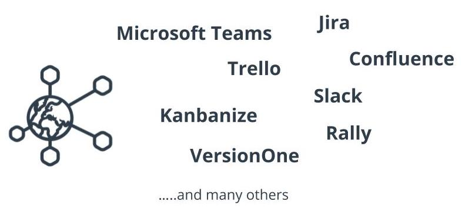

# Agile Tools

Agile tools are excellent communication and collaboration resources:

- They, help track **progress**, **iteratively** assign work, track **defects**, etc.
- They, help **monitoring** the team's progress in a **transparent** and **visible** manner.
- Majority of the tools are **customizable** to accommodate Agile teams
  - In various industries
  - With various Agile frameworks.
- Agile tools make **cross-functional** teamwork and collaboration easier, whether is:
  - Pre-planning  with the product team to geeting user feedback from the customers directly.
- Agile tools provide real-time **dashboard** and **reports**, that shows that Agile teams's progress against the product roadmap.
  - This helps Agile teams better **estimate capacity** for **future iterations**.

**Note:** When used properly, Agile tools help elevate and Agile Teams effectiveness and efficiency to deliver values.

