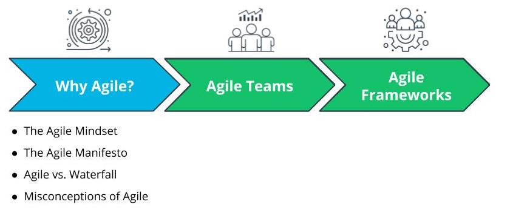

# Introduction

## What We Will Cover In This Lesson

In this lesson, we will focus on the foundational theory behind Agile. We will discuss:

- The Agile Mindset and Value-Driven delivery benefits of agile. You will be able to differentiate between ‘Being’ Agile versus just ‘Doing’ Agile  
- The Agile Manifesto, and how it is seen as the foundational set of 4 Paired Core Values and 12 Principles that sets the foundation for all Agile Frameworks
- How Agile differs from the more traditional Waterfall approach to product development

**Note:** At the end we will wrap up the lesson with an important discussion on common misconceptions about Agile.

## By the End of the Lesson, You Will Be Able To...

- Explain the **Agile Mindset** and value-driven delivery benefits of Agile
- Differentiate between Doing Agile and Being Agile
- Explain The Agile Manifesto’s **4 Paired Core Values**
- Identify and apply the 12 Principles of the **Agile Manifesto**
- Differentiate between **Agile** and **Waterfall** approaches

