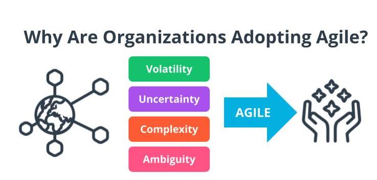
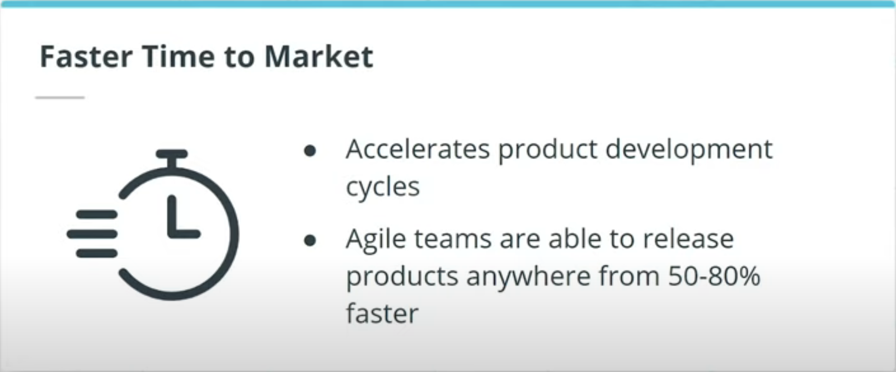
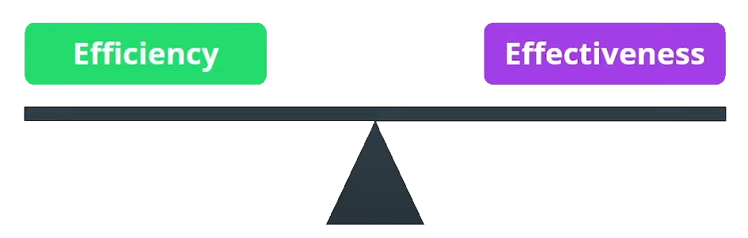
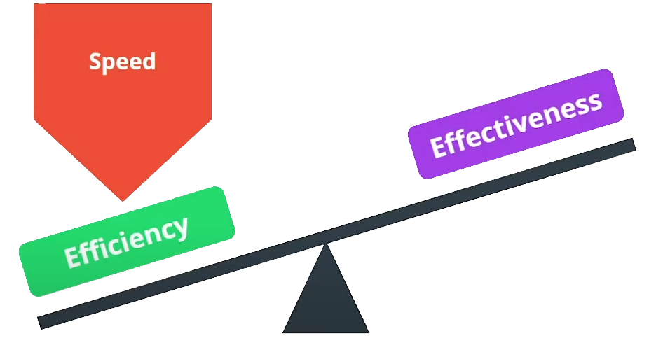
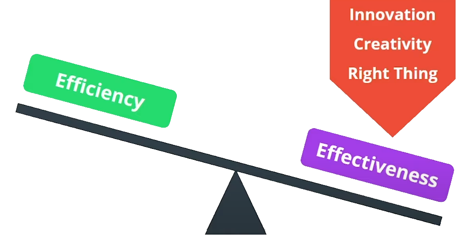
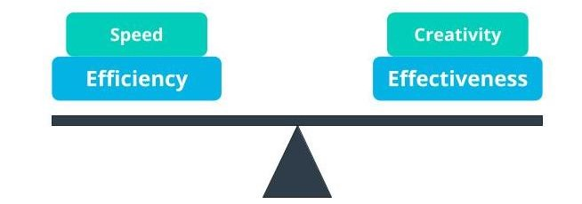
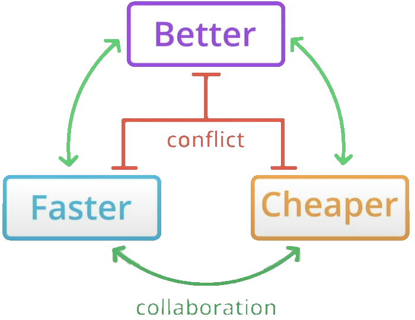

# Why Agile

## Why Are Organizations Adopting Agile

In an increasingly interconnected and competitive global marketplace, I am seeing Agile being leveraged by successful organizations across the globe to thrive in today’s digital age. Agile enables organizations to predictably deliver value in a world where we are constantly being challenged with Volatility, Uncertainty, Complexity, and Ambiguity. Organizations that I have seen go through Agile transformation have benefited from the following:

### Faster time to market
  
- An agile approach accelerates product development cycles.
- Agile teams are able to release products anywhere from 50-80% faster than teams that continue to use a more traditional approach to product development.

### Early Return on Investment (ROI)
  
Agile helps us accomplish two things:

- Help squeeze cash out of Work in Progress (WIP).
- Increase project and portfolio return.
  
  Squeeze Cash Out of WIP | Increase Returns
  ----------------------- | ----------------
  **_Invest cash flexibly as product evolves_:** In Agile, by not allocating funds up front and hampering organizational liquidity, cash is freed up to more flexibly invest as the product evolves based on market needs.| **_Fail fast/stop early_:** Agile allow us to fail fast or even stop early
  **_Less work on non-value added features_:** Waste, commonly referred to as the Japanese term Muda in real-world, is reduced by trimming down on unproven assumptions and mitigating the chances when investing in no-value added features. That is, features that are of no value and are probably a waste of resources. | **_Move funds to higher value project_:** This allows executive to move funds around from one project to another at a portfolio level.
  **_Better Prioritization_:** This helps a product management team prioritize features more proactively and steer towards better decisions for products's success. | **_Better alignment with the market_:** Priorities are re-evaluated more frequently and proactively to maintain a close alignment to the pulse of the market.

### Feedback From Real Customers
  
  Early feedback loop from the customer or proxy who represents the customer is priceless. Frequent feedback from the business and end-users ensures:

- **Focuses the team on the intended goal:**  The Agile team is focused on the solutions and intended goals.
- **Ensure delivery of high-value features:**
- **Allows the team to accommodate change:** Feedback loops allow the team to accommodate change later in development process, particularly as newer refined requirements emerge.

Organizations that go through Agile transformation have also benefited from:

### Build the Right Products

Developing and delivering products which customers do not want and for which there may not be a market can be an expensive adventure. Agile works to efficiently develop products where the chances of it being valuable customers and end users is enhanced.

- **Connects product strategy to execution:** Agile advocates for ensuring that the product strategy and execution remain aligned.
- **Iterative approach allows for adjustment:** The heartbeat of Agile is the iterative approach which allows for adjustment to ensure value-driven items are delivered in short time frames.
- **Communication and Collaboration:** The proactive and transparent collaborative communication stands in Agile, allows for constructive and genuine user and market-driven insight to ensure the product is heading in the right direction.

### Early Risk Reduction

Agile helps manage risks more proactively.

- **Risks are managed proactively:** By evaluating project progress more frequently, we are able to meaningfully evaluate during each iteration. This helps the team measure delivered value, as well as showcase working product to obtain realistic feedback.
- **Risk reduction accomplished through iterative delivery:** Specifically, risk reduction is accomplished through iterative delivery as requirements are discovered, prioritized, and demoed to representatives from the business, commonly referred to as business proxies in Agile.
  Agile exposes and provides the opportunity to recognize and manage risk early. Risks are managed through cross-functional teams that respect and understand each other's skills sets, sustainable and predictable pace, continuous feedback, and technical excellence, that is built-in quality.
- **Transparency ensures risks are managed early:** This transparency ensures risks are managed early.

### Built-in Quality

- **Business benefits justify the investment in quality:** Building and delivering high-quality products requires a commitment, but the business benefits and value delivered justify this investment.
- **Elevated customer satisfaction:** The business benefits from elevated customer satisfaction, as well as better velocity, which is essentially a measure of how much valuable work was completed in an iteration. The business also benefits from a more predictable pace of the products incremental delivery.
- **Ability to innovate and scale confidently:** A more reliable solution environment enables an agile team to confidently innovate and scale.

### Culture and morale

- **Open communication, collaboration and cohesiveness:** Agile emboldens the culture by encouraging open communication, collaboration and cohesiveness driven by a common business value-driven goal.
- **Productive sustainable pace:** By breaking down silos, Agile promotes a more adaptable work environment that boost morale, prevents burnout, and encourage a highly productive, sustainable pace.
- **Motivation to find opportunities that benefit the business:** When treated with respect, Agile team members evolve their practices and find opportunities that benefit the business. This aspiration is elevated when Agile teams understand the larger purpose purpose their work.

### Efficiency vs. Effectiveness

**Note:** Efficiency and effectiveness is a fine balancing act that Agile recommends

- If you only focused on going fast, you prioritize efficiency

- But if you are trying to focus on innovation, creativity, and making sure you're working on the right thing, you need to focus on effectiveness.
This is often done at the cost of efficiency.

Agile ensures a balanced approach whereby Agile Teams ensure there is a balance between speed and creativity.

Agile Principles specifically recommend:

#### Customer Satisfaction

- **A key Agile principle:** is customer satisfaction
- **Value driven high quality product features and functionality:** By delivering product features and functionality with built-in quality that offer business value, the customer is kept satisfied. Customer satisfaction is further increased because they are requested features are delivered not only early in the project life cycle, but also continuously, as a product has evolved and enhanced based on market feedback.
- **Customer satisfaction is ensured through Product Owner:** Agile projects include a product owner who is an individual responsible for ensuring clear translation of what the customer wants into product requirements.

#### Alignment

- **Keep the _Vision_ in focus:** Agile helps teams keep the vision in focus. The vision drives what is to be included and excluded in the list of features and functionality, which is customarily called a product backlog in Agile.
- **Helps the business build a decision making framework for prioritization:** Agile is the deliberate goal of setting challenging but very realistic expectations, helps ensure that the business owners needs are being prioritize and met while effectively managing their expectations.
- **Sets clear guidelines for incremental product views:** In Agile, milestones and accomplishments are based on demonstrable results through the objective evaluation of working systems. Such demos give business owners an opportunity to ensure the Agile teams work is aligned with the vision

#### Emergent Outcomes

- **Works well in developing complex dynamic systems:** Agile works well in the development of complex dynamic systems
- **Valuable results can emerge:** Self-organizing interactions among the Agile team, they give rise to outcomes that may be different from or in addition to any anticipated or targeted outcomes.
The initially unplanned, yet valuable results can emerge in such circumstances.
- **Agile can accommodate such uncertainty:** Agile framework are designed to accommodate such emergent needs.

#### Predictability

- **Low risk and highly predictable approach:** Agile project management includes many practices, tools, and artifacts to improve predictability, which help reduce risk.
- **Adaptive planning:** Agile's adaptive planning approach is an iterative approach which organizes several information flows, analyses, issues, and opinions that coalesce into predictable decisions that align with the strategy.
For example, successful agile organizations keep the same iteration length, and Agile team allocation throughout the product development life-cycle.
- **Ensures structure within the 'chaos' of complexity:** This ensures some structure within chaos. This also enables the project team to predict the exact cost for each iteration.

### Why Companies Are Switching

1. Faster time to market
1. Early ROI
1. Feedback from real customers
1. Build the right products
1. Early risk reduction
1. Better quality
1. Culture and morale
1. Efficiency
1. Customer satisfaction
1. Alignment
1. Emergent outcomes

Today's digitally complex and interconnected business world is driving organization to seek avenues to increase speed to market, need customer demand, and increase team productivity.
An organization want to use Agile to get there by developing products better, faster, and cheaper.

### Quiz Question

1. TRUE or FALSE: Agile enables organizations to deliver additional value through Business Agility. **true**
1. Which of the following statements is true about Agile?
[Select all that apply]

[x] The Agile method method anticipates change and allows for much more flexibility than traditional methods.
[x] Clients can make small objective changes without huge amendments to the budget or schedule.
[x] The Agile method is based on giving high priority to customer participation, from the very beginning of the development cycle.

### New Terms

- **Ambiguity**: Ambiguity refers to a lack of clarity, such as not having a clear understanding of the genuine needs of the customer and end-users
- **Complexity**: Complexity exists when there are many interconnected parts and variables that influence each other
- **Muda**: Lean principles refer to the Japanese term Muda as waste; Agile teams focus on the removal of non-value adding tasks that are seen as Muda
- **Product Owner**: A business proxy or representative of the business users who is the Voice of the Customer (VOC)
- **Return on Investment (ROI)**: Return on investment (ROI) is calculated as the ratio between net profit and cost of investment over a defined period of time
- **Uncertainty**: The extent to which an organization can confidently predict or forecast the future; more uncertainty makes it harder to predict
- **Voice of the Customer**: A term used to articulate the steps to capture customer's needs
- **Volatility**: Volatility is when there are unexpected or unstable possibilities that may influence the work being done
- **VUCA**: Volatility, Uncertainty, Complexity, Ambiguity
- **WIP (Work in Progress)**: The work that has been started but not yet completed
