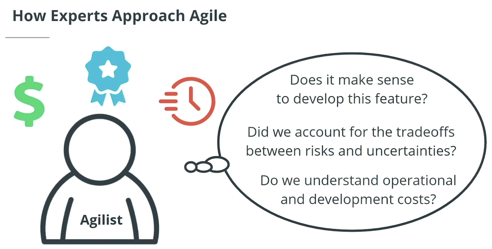
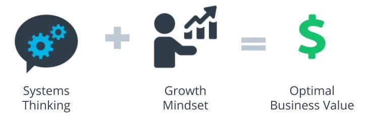

# How Experts Approach Agile

## Thinking About Agile

Agile experts or Agilists adopt a practical and realistic approach to delivering the best value, and quality, in the shortest sustainable time.
So Agilists take into account an understanding of the economics of delivering products. In other words, decisions by Agile experts are made within a proper economic context where we ensure that it makes the most sense financial sense to proceed with developing a particular feature or feature set.
Agile experts also take into account the trade-offs between risks and uncertainties, as well as operational and development costs.

## Agile Is Based on a Systems Thinking Approach and a Growth Mindset

- A Systems Thinking approach, reinforced by a Growth Mindset, helps Agile experts deliver optimal business value.

